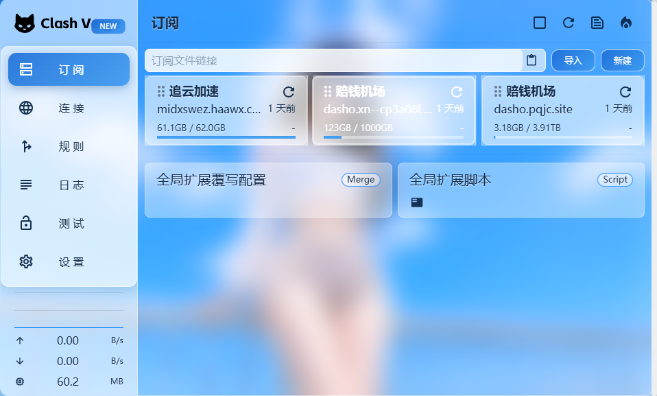

# Clash Verge Rev Themes · 主题合集

> A collection of custom CSS themes for [Clash Verge Rev](https://github.com/clash-verge-rev/clash-verge-rev). Each theme lives in its own folder under [`themes/`](themes/) with its own README, previews and CSS files. Paste-and-go, no build step.

Clash Verge Rev 自定义 CSS 主题合集。**每个主题一个独立文件夹**，带各自的文档、预览图与 CSS 文件；本 README 只做综合索引与通用说明。

## 主题列表 · Themes

| 主题 | 风格 | 预览 | 说明 |
|---|---|:---:|---|
| [夏日晴空 SummerGlass](themes/summer-sky/) | 夏日晴空 × 磨砂玻璃拟态，天空蓝点缀 | [](themes/summer-sky/) | 高透明 / 正常两档，壁纸 base64 内嵌离线可用 |

## 通用安装 · Install（适用于所有主题）

1. 打开 Clash Verge Rev → **设置** → **外观**
2. 找到 **自定义 CSS** 输入框
3. 进入主题文件夹，选择想要的档位 CSS 文件，**全选复制，整段粘贴**
4. 界面立即生效，换档位直接替换粘贴内容即可

## 换壁纸 · Change Wallpaper（通用做法）

多数主题壁纸以 base64 内嵌（离线可用、无外链）：

1. 准备一张 1600px 宽左右的 JPG（建议 ≤ 200KB，太大 CSS 会很重）
2. 转成 base64（`base64 wall.jpg` / [在线工具](https://base64.guru/converter/encode/image)）
3. 替换 CSS 中 `html, body, #root { background: url("data:image/jpeg;base64,……")` 里那一长串 base64

各主题的档位参数、特性差异见其文件夹内 README。

## 新增主题 · Adding a Theme

按以下结构建文件夹即可（PR 欢迎）：

```
themes/
└── <theme-name>/          # 主题名（英文小写连字符）
    ├── README.md          # 该主题的文档：预览、档位参数、安装、特性
    ├── <theme-name>-*.css # 各档位 CSS
    └── previews/          # 预览截图（档位各一张）
```

要求：单文件自包含 CSS、壁纸内嵌、不依赖 `css-xxxxxx` 哈希类名（客户端升级易失效）。

## License

[MIT](LICENSE) · 各主题版权见其文件夹
