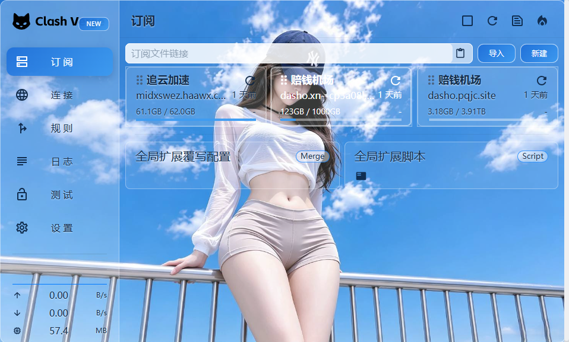
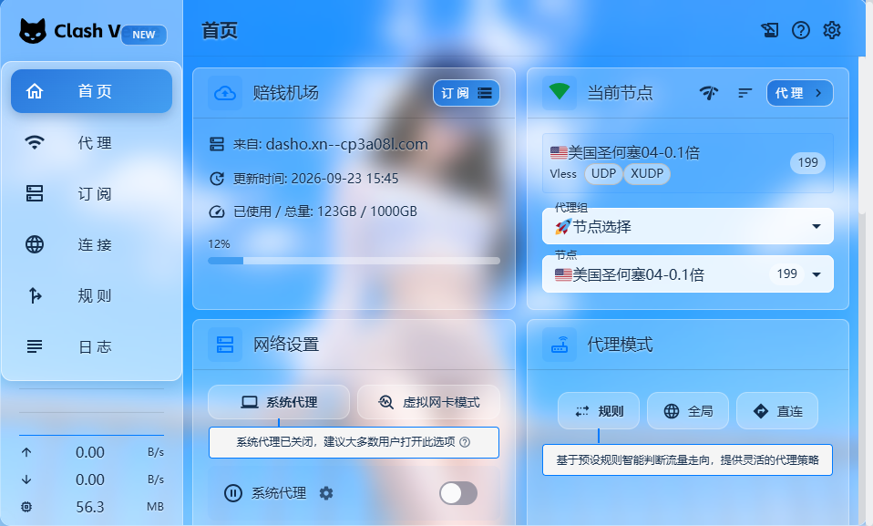

# 夏日晴空 · SummerGlass

> 夏日晴空 × 玻璃拟态主题：壁纸清晰锐利、天空蓝点缀。三档透明度任选，整段粘贴即用。

## 档位 · Tiers

| 文件 | 风格 |
|---|---|
| [`clash-verge-summer-sky-ultra.css`](clash-verge-summer-sky-ultra.css) | **纯透明无磨砂**：卡片只是一层薄雾白纱 + 细描边，透过去直接看到清晰壁纸，全屏无一处模糊 |
| [`clash-verge-summer-sky-high.css`](clash-verge-summer-sky-high.css) | 高透明磨砂：卡片内轻微虚化，轮廓通透 |
| [`clash-verge-summer-sky-normal.css`](clash-verge-summer-sky-normal.css) | 正常磨砂（推荐）：通透与可读平衡 |

## 预览 · Previews

| Ultra（纯透明） | High（高透明磨砂） | Normal（正常磨砂） |
|:---:|:---:|:---:|
|  |  |  |

## 安装 · Install

1. 打开 Clash Verge Rev → **设置** → **外观**
2. 找到 **自定义 CSS** 输入框
3. 打开本目录下任意一档 CSS，**全选复制，整段粘贴**
4. 界面立即生效；换档位直接替换粘贴内容

## 换壁纸 · Change Wallpaper

壁纸以 base64 内嵌在 CSS 中（离线可用、无外链依赖）：

1. 准备一张 1600px 宽左右的 JPG（建议 ≤ 200KB）
2. 转成 base64（`base64 wall.jpg` / [在线工具](https://base64.guru/converter/encode/image)）
3. 替换 CSS 中 `html, body, #root { background: url("data:image/jpeg;base64,……")` 里那一长串 base64 即可

## 特性 · Features

- **三档任选**：纯透明 / 高透明 / 正常磨砂，一段 CSS 粘贴即用，随时切换
- **壁纸清晰**：夏日晴空壁纸全程锐利显示（ultra 档全屏无一处模糊）
- **换壁纸方便**：替换一段 base64 就能换成任意喜欢的壁纸
- **离线可用**：单文件 CSS，壁纸内嵌，复制粘贴就能用

## 兼容性 · Compatibility

针对 **Clash Verge Rev**（基于官方 `dev` 分支前端源码类名核对）。若客户端大版本升级后个别区块样式丢失，F12 查看该元素类名提 issue 即可。
